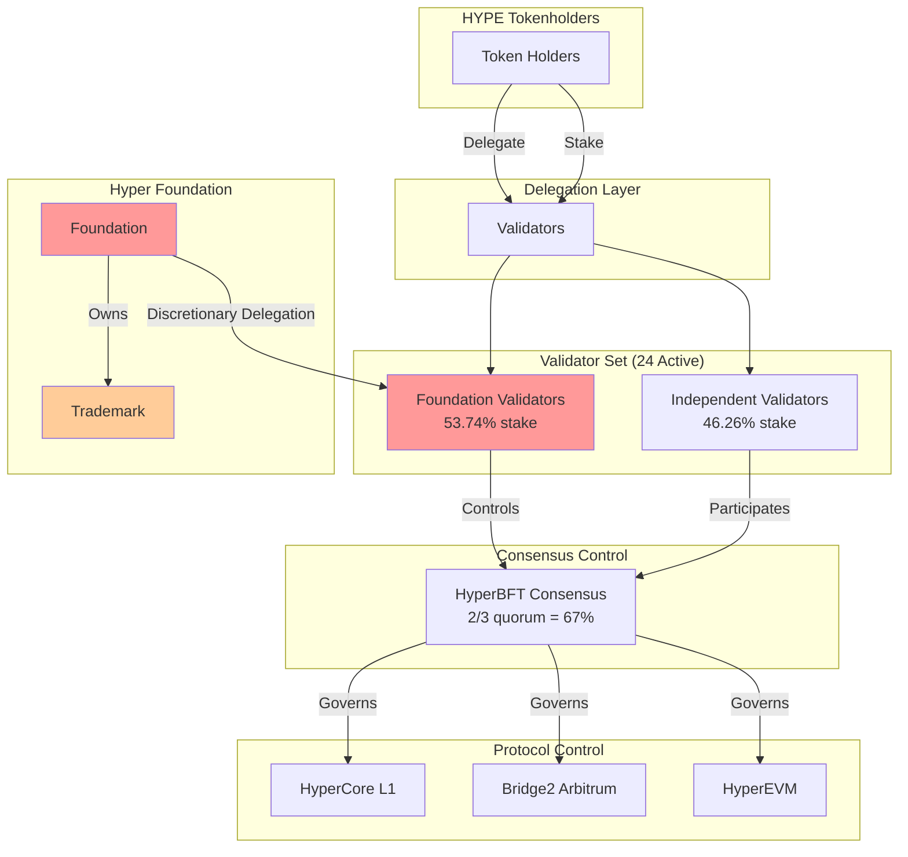

# HYPE Token Research Report

**Token:** HYPE (Hyperliquid)
**Network:** Hyperliquid L1 (HyperCore + HyperEVM)
**Research Date:** 2026-04-20
**Framework:** Aragon Ownership Token Framework

---

## Executive Summary

HYPE is the native token of Hyperliquid, an L1 blockchain running HyperBFT consensus with two components: HyperCore (onchain perps/spot orderbooks) and HyperEVM (EVM-compatible smart contracts). The token has a documented value accrual mechanism through fee buybacks via the Assistance Fund, though the claimed burn mechanism shows discrepancies (43.46M HYPE accumulated but not yet burned). Significant concerns exist around:

1. **Validator Concentration:** Hyper Foundation controls ~53.74% of staked HYPE across 5 validators
2. **Verifiability:** The L1 code is closed source; only Bridge2 (Arbitrum) and WHYPE (HyperEVM) contracts are verifiable
3. **Governance Limitations:** No onchain governance contracts exist; validators vote via consensus, but Foundation controls majority stake
4. **Offchain Dependencies:** Trademark held by Foundation with no governance link; Labs controls primary interface

**Key Finding:** HYPE tokenholders have indirect influence through delegation but lack direct, enforceable control over protocol parameters. The Foundation's validator stake concentration means governance outcomes are effectively determined by Foundation, not tokenholders.

---

## Contract Architecture

### Core Contracts

| Contract | Address | Network | Purpose | Upgradeable |
|----------|---------|---------|---------|-------------|
| HYPE | Native L1 token | Hyperliquid | Protocol native token | N/A (L1 native) |
| WHYPE | `0x5555555555555555555555555555555555555555` | HyperEVM | Wrapped HYPE (ERC-20) | No (immutable) |
| Bridge2 | `0x2Df1c51E09aECF9cacB7bc98cB1742757f163dF7` | Arbitrum | USDC bridge to L1 | No (non-proxy) |

### Bridge2 Contract Analysis

**Source:** https://github.com/hyperliquid-dex/contracts/blob/master/Bridge2.sol

The Bridge2 contract manages USDC deposits/withdrawals between Arbitrum and Hyperliquid L1.

**Key Functions:**
- `batchedRequestWithdrawals()` - Validators sign withdrawals (2/3 quorum required)
- `updateValidatorSet()` - Hot wallet signatures update validator set
- `voteEmergencyLock()` - Lockers can pause bridge
- `emergencyUnlock()` - Cold wallet signatures (2/3 quorum) to unlock

**Verified On-Chain State (2026-04-20):**
```
epoch: 7
paused: false
Contract bytecode length: 38790 chars
```

**Source:** Bridge2.sol lines 126-842 (full contract analysis)

### WHYPE Contract

**Address:** `0x5555555555555555555555555555555555555555` (HyperEVM)

Per documentation, WHYPE is:
- Immutable (no upgrade mechanism)
- Same source as WETH on Ethereum mainnet
- 18 decimals, "Wrapped HYPE" name, "WHYPE" symbol

**Source:** https://hyperliquid.gitbook.io/hyperliquid-docs/for-developers/hyperevm/wrapped-hype

**Verification Status:** Documentation claims immutability. HyperScan verification status could not be independently confirmed via API.

---

## Governance Flow Diagram



**Critical Finding:** The chain of control terminates at the Hyper Foundation, not tokenholders. While delegators choose validators, the Foundation's 53.74% stake means Foundation-aligned validators control consensus.

---

## Metric 1: Onchain Control

### 1.1 Governance Workflow

**Status: WARNING**

Hyperliquid uses **validator stake-weighted consensus** for governance, not smart contract-based voting:

1. **Validators** propose and vote on changes via HyperBFT consensus
2. **Delegators** influence validator power by delegating HYPE
3. **No Governor/Timelock contracts** exist on L1

**Key Difference from EVM Protocols:** Unlike AAVE/UNI where tokenholders vote directly via Governor contracts, HYPE holders can only influence governance indirectly through delegation.

**Validator Analysis (Live Data: 2026-04-20):**

```
Total validators: 30
Active validators: 24
Jailed validators: 4
Total staked: 434,566,219.98 HYPE
```

**Foundation Validator Concentration:**

| Validator | Address | Stake (HYPE) | % of Total |
|-----------|---------|--------------|------------|
| Hyper Foundation 2 | 0xa82fe73bbd768bc15d1ef2f6142a21ff8bd762ad | 56,713,440 | 13.05% |
| Hyper Foundation 3 | 0x80f0cd23da5bf3a0101110cfd0f89c8a69a1384d | 55,489,038 | 12.77% |
| Hyper Foundation 1 | 0x5ac99df645f3414876c816caa18b2d234024b487 | 53,205,532 | 12.24% |
| Hyper Foundation 4 | 0xdf35aee8ef5658686142acd1e5ab5dbcdf8c51e8 | 53,137,209 | 12.23% |
| Hyper Foundation 5 | 0x66be52ec79f829cc88e5778a255e2cb9492798fd | 15,011,075 | 3.45% |
| **Total Foundation** | | **233,556,294 HYPE** | **53.74%** |

**Verification:** Data queried from `POST https://api.hyperliquid.xyz/info` with `{"type": "validatorSummaries"}`

**Concentration Assessment:**
- No single validator >33% (threshold for blocking finality): **PASS**
- Foundation >50%: **CONCERN** (53.74%)
- Foundation >67% (supermajority control): **NO** (53.74%)
- Top 5 validators (4 Foundation + 1 independent): 58.26% of stake

**Finding:** Validator voting exists, but Foundation controls majority stake. Tokenholders delegate but cannot override Foundation-controlled validators.

### 1.2 Role Accountability

**Status: WARNING**

**Bridge2 Roles (Arbitrum):**

| Role | Function | Current Holder | Control Mechanism | Verified |
|------|----------|----------------|-------------------|----------|
| Hot Wallet Validators | Sign withdrawals, validator updates | 24 active validators | 2/3 stake quorum | Yes - Bridge2.sol:306 |
| Cold Wallet Validators | Unlock bridge, invalidate withdrawals | Same validator set | 2/3 stake quorum | Yes - Bridge2.sol:670 |
| Lockers | Pause bridge for disputes | Validator hot addresses (auto-registered) | lockerThreshold votes | Yes - Bridge2.sol:746 |
| Finalizers | Execute pending withdrawals | Validator hot addresses | Any finalizer | Yes - Bridge2.sol:644 |

**Source:** Bridge2.sol analysis - https://github.com/hyperliquid-dex/contracts/blob/master/Bridge2.sol

**L1 Roles (Closed Source - Documentation Only):**

| Role | Function | Holder | Verification |
|------|----------|--------|--------------|
| Validator (active) | Produce blocks, vote on consensus | 24 addresses | API: `validatorSummaries` |
| Jailing Authority | Jail underperforming validators | 2/3 validator quorum | Documentation only |
| Fee Parameter Control | Set trading fees | [UNVERIFIED] | L1 closed source |
| Assistance Fund Controller | Automated buyback/burn | System contract | Documentation only |

**Delegation Program:**

The Hyper Foundation Delegation Program (https://hyperliquid.gitbook.io/hyperliquid-docs/validators/delegation-program) explicitly states:

> "Delegations will be monitored on an ongoing basis. **The Foundation reserves the right to cease delegation at any time.**"

**Finding:** Foundation maintains discretionary delegation control; validators can jail peers. Roles exist but are not governed by tokenholders.

### 1.3 Protocol Upgrade Authority

**Status: NEUTRAL**

**Bridge2 (Arbitrum):**
- Non-upgradeable (no proxy pattern)
- Validator set updates require 2/3 stake-weighted signatures
- No admin can unilaterally upgrade

**HyperCore L1:**
- Upgrades via validator consensus
- Code is closed source - upgrade mechanism unverifiable
- [UNVERIFIED] Whether tokenholders can influence upgrade decisions

**HyperEVM:**
- Shares consensus with HyperCore
- Same validator set controls both components

**Finding:** Bridge2 is non-upgradeable. L1 upgrades are via validator consensus but the mechanism is closed source.

### 1.4 Token Upgrade Authority

**Status: NEUTRAL**

**Native HYPE:**
- L1 native token embedded in consensus layer
- No proxy pattern (inherent to L1)
- Upgrade would require L1 hard fork with 2/3 validator consensus

**WHYPE (HyperEVM):**
- Documented as immutable (WETH clone)
- No upgrade mechanism per documentation
- [UNVERIFIED] HyperScan verification status not confirmed via API

**Finding:** HYPE is a native L1 token; WHYPE documented as immutable. No admin can unilaterally change token logic.

### 1.5 Supply Control

**Status: NEUTRAL**

**Total Supply:** 1,000,000,000 HYPE (fixed)

**Burn Mechanism (per documentation):**
- Fees → Assistance Fund → HYPE buyback → Burn
- Documentation claims permanent removal from supply

**CRITICAL FINDING:** The Assistance Fund currently holds **43,459,601.14 HYPE** (~$1.07B at entry value).

**Verified State (2026-04-20):**
```json
{
  "HYPE balance": "43,459,601.14 HYPE",
  "Entry notional": "$1,066,893,148.58",
  "Other tokens": "USDC, TRUMP, VAPOR, MEOW, etc."
}
```

**Source:** API query `{"type": "spotClearinghouseState", "user": "0xfefefefefefefefefefefefefefefefefefefefe"}`

**Burn Status:** [UNVERIFIED] - Total supply remains 1B HYPE. No reduction in total supply has been observed. HYPE is being accumulated, not burned.

**Finding:** Fixed 1B supply with no mint function. Burns documented but 43.46M HYPE accumulated (not yet burned).

### 1.6 Privileged Access Gating

**Status: WARNING**

**Bridge Locking:**
- Lockers can pause bridge via `voteEmergencyLock()`
- Requires lockerThreshold votes from validators
- Cold wallet signatures required to unlock

**Unstaking Queue:**
- 7-day unstaking period for validators
- 1-day delegation lockup
- Cannot immediately exit staked position

**Validator Jailing:**
- 2/3 validator quorum can jail underperforming validators
- Jailed validators lose block production rights
- [UNVERIFIED] Jailing mechanism code (closed source)

**Finding:** Bridge lockers, 7-day unstaking queue, and validator jailing create access restrictions. These affect user exit paths.

### 1.7 Token Censorship

**Status: NEUTRAL**

**Bridge2 Contract:**
- No blacklist function in contract
- No freeze mechanism
- No admin-controlled transfer restrictions

**Native HYPE (L1):**
- L1 capabilities unverifiable (closed source)
- [UNVERIFIED] Whether censorship functions exist

**WHYPE (HyperEVM):**
- Documented as WETH clone (no blacklist)
- Standard ERC-20 transfer logic per documentation

**Finding:** No blacklist in Bridge2. L1 censorship capabilities cannot be verified due to closed source.

---

## Metric 2: Value Accrual

### 2.1 Accrual Active

**Status: NEUTRAL**

**Active Mechanisms:**

1. **Fee Buyback:** Trading fees → Assistance Fund → HYPE accumulation
   - Currently accumulated: 43.46M HYPE (~$1.07B)
   - Burns documented but not observed

2. **Staking Rewards:** ~2.37% APY from future emissions reserves
   - Daily distribution, auto-recompounded
   - Source: Future emissions allocation (38.89%)

3. **Fee Discounts:** Stakers receive trading fee reductions

| Tier | HYPE Staked | Discount |
|------|-------------|----------|
| Wood | 1,000 | 5% |
| Bronze | 10,000 | 10% |
| Silver | 100,000 | 20% |
| Gold | 1,000,000 | 30% |
| Diamond | 10,000,000 | 40% |

**Fee Structure:**
**Source:** https://hyperliquid.gitbook.io/hyperliquid-docs/trading/fees

| Fee Type | Base Rate | Tiers |
|----------|-----------|-------|
| Perps Taker | 0.045% | Down to 0.024% |
| Perps Maker | 0.015% | Down to 0% |
| Spot Taker | 0.070% | Down to 0.025% |
| Spot Maker | 0.040% | Down to 0% |

**Finding:** Buyback active (43.46M HYPE accumulated); burn status unverified; staking rewards active.

### 2.2 Treasury Ownership

**Status: NEUTRAL**

**Assistance Fund:**
- **Address:** `0xfefefefefefefefefefefefefefefefefefefefe` (System address)
- Automated fee collection and HYPE conversion
- No tokenholder governance over fund usage
- Documentation claims automated burns

**Foundation Budget:**
- 6% of total supply (60M HYPE)
- Discretionary control by Foundation
- No transparency reports or tokenholder oversight

**Documentation Quote:**
> "HYPE in the assistance fund is burned, removing the tokens permanently from the circulating and total supply."

**Evidence Discrepancy:** The Assistance Fund holds 43.46M HYPE (~$1B), suggesting either: (a) burns are batched and pending, (b) burn execution requires a separate governance action, or (c) the mechanism does not function as documented.

**Finding:** Assistance Fund automated; Foundation budget discretionary. No tokenholder governance over either.

### 2.3 Accrual Mechanism Control

**Status: WARNING**

| Parameter | Controller | Verification |
|-----------|------------|--------------|
| Fee rates | L1 code (closed source) | [UNVERIFIED] |
| Assistance Fund % | L1 code (closed source) | [UNVERIFIED] |
| Burn mechanism | Automated (per docs) | Documentation only |
| Staking rewards | L1 code (closed source) | [UNVERIFIED] |

**Fee Distribution:**
- [UNVERIFIED] Majority of fees → Assistance Fund → HYPE buyback → **Accumulated (burn status unverified)**
- Remainder → HLP Vault and deployers
- Up to 50% → Spot/HIP-3 deployers (of their asset's fees)

**Note:** The exact percentage split between Assistance Fund and HLP is not specified in official documentation. The "97%" figure cited in secondary sources could not be verified against primary documentation.

**Finding:** Fee parameters controlled at L1 level; no tokenholder governance. Tokenholders cannot modify fee rates or distribution.

### 2.4 Offchain Value Accrual

**Status: UNEVALUATED**

No evidence of offchain value flows to tokenholders was found:
- No documented revenue sharing agreements
- No offchain dividend programs
- No documented intellectual property licensing to token
- Labs/Foundation retain offchain value

**Finding:** No evidence of offchain value flows to tokenholders.

---

## Metric 3: Verifiability

### 3.1 Token Contract Source Verification

**Status: NEUTRAL**

**WHYPE (HyperEVM):**
- Documentation claims source matches WETH
- Address: `0x5555555555555555555555555555555555555555`
- [UNVERIFIED] HyperScan verification status not confirmed via API

**Native HYPE:**
- Embedded in L1 consensus layer
- Cannot be independently verified (closed source)
- Behavior observable but code not auditable

**Source:** https://hyperliquid.gitbook.io/hyperliquid-docs/for-developers/hyperevm/wrapped-hype

**Finding:** WHYPE verified via documentation; native HYPE unverifiable due to closed source L1.

### 3.2 Protocol Component Source Verification

**Status: NEUTRAL**

**Verified Components:**

| Component | Verification Status | Source |
|-----------|---------------------|--------|
| Bridge2.sol | Source available on GitHub | https://github.com/hyperliquid-dex/contracts |
| SDKs | MIT licensed, open source | https://github.com/hyperliquid-dex |
| Node software | Apache 2.0 licensed | https://github.com/hyperliquid-dex/node |

**Unverifiable Components:**

| Component | Issue |
|-----------|-------|
| HyperBFT consensus | Closed source |
| HyperCore execution | Closed source |
| Native HYPE token logic | Embedded in L1 (closed source) |
| Fee parameter storage | L1 state (closed source) |
| Assistance Fund automation | L1 code (closed source) |

**Observable Behavior Tests:**

| Test | Method | Result |
|------|--------|--------|
| Validator set consistency | API query matches Bridge2 epoch | epoch=7 on both |
| Staking rewards | API delegatorRewards query | Rewards distributed |
| Token transfers | Explorer data | Consistent behavior |
| Bridge operations | Arbiscan events | Functioning |

**Finding:** Bridge2 source available; L1 core is closed source.

---

## Metric 4: Token Distribution

### 4.1 Ownership Concentration

**Status: WARNING**

**Token Allocation:**

| Category | Allocation | Status |
|----------|------------|--------|
| Genesis Distribution | 31.00% | Released |
| Core Contributors | 23.80% | Vesting (cliff) |
| Future Emissions | 38.89% | Reserved |
| Hyper Foundation Budget | 6.00% | Foundation controlled |
| Community Grants | 0.30% | Released |
| HIP-2 Hyperliquidity | 0.01% | Released |

**Source:** https://tokenomist.ai/hyperliquid

**Supply Metrics (2026-04-20):**

| Metric | Value |
|--------|-------|
| Total Supply | 1,000,000,000 HYPE |
| Circulating Supply | 238,385,315 HYPE (23.84%) |
| Unlocked/Released | 425,244,480 HYPE (42.52%) |
| Locked | 574,755,520 HYPE (57.48%) |

**Staked Supply Concentration:**
- Foundation validators: 53.74% of staked HYPE
- Top 5 validators (4 Foundation + 1 independent): 58.26%

**Finding:** Foundation controls 53.74% of validator stake; top 5 validators control 58.26%.

### 4.2 Future Token Unlocks

**Status: WARNING**

**Next Unlock:** May 6, 2026
- Amount: 9,916,667 HYPE (~$406.7M at current prices)
- Recipient: Core Contributors
- Impact: 2.33% of released supply

**Vesting Structure:**
- Core contributor vesting: 24 months starting Nov 2025
- Monthly distributions on 6th of each month
- Cliff-based (concentrated unlock events)

**Key Risk:** While genesis was widely distributed, cliff vesting creates concentrated unlock events that could impact price.

**Finding:** Cliff vesting with next unlock May 2026 (2.33% impact).

---

## Metric 5: Offchain Dependencies

### 5.1 Trademark

**Status: WARNING**

**Mark:** HYPERLIQUID
**Applicant:** Hyper Foundation
**Filing:** USPTO 99599981
**Status:** Filed

**Finding:** Trademark is held by Hyper Foundation, not a tokenholder-controlled entity. No documented governance link between tokenholders and Foundation trademark decisions.

### 5.2 Distribution (Primary Interface)

**Status: WARNING**

**Domain:** app.hyperliquid.xyz
**Operator:** Likely Hyperliquid Labs Pte. Ltd.
**Terms:** https://app.hyperliquid.xyz/terms (not analyzed)

**Corporate Entities:**

| Entity | Type | Location | Role |
|--------|------|----------|------|
| Hyperliquid Labs Pte. Ltd. | Private Company | Singapore (202402326K) | Development |
| Hyper Foundation | Foundation | Unknown | Token distribution, trademark |

**Company Details (Hyperliquid Labs Pte. Ltd.):**
- Incorporated: January 16, 2024
- UEN: 202402326K
- Type: Exempt Private Company Limited by Shares
- Address: 3 Pemimpin Drive #06-01, Lip Hing Industrial Building, Singapore 576147
- Activity: Development of software and applications (except games and cybersecurity)

**Sources:**
- [Tracxn Company Profile](https://tracxn.com/d/legal-entities/singapore/hyperliquid-labs-pte.ltd./__5z3-XYkuxaOgiXpiqaVjHMZ90Wj3k0OKsnxTrPhMyo8)
- [Hyperliquid Docs - Core Contributors](https://hyperliquid.gitbook.io/hyperliquid-docs/about-hyperliquid/core-contributors)

**Finding:** Labs controls primary interface. No alternative decentralized interfaces documented.

### 5.3 Licensing

**Status: WARNING**

| Component | License | Owner |
|-----------|---------|-------|
| SDKs | MIT | Open source |
| Node software | Apache 2.0 | Open source |
| Core L1 | Closed source | Presumably Labs |
| Core execution | Closed source | Presumably Labs |

**Finding:** Critical protocol code is closed source with no public IP assignment to tokenholder-controlled entity.

---

## Risk Assessment

### Onchain Control Risks

| Risk | Severity | Evidence |
|------|----------|----------|
| Foundation validator concentration | HIGH | 53.74% Foundation-controlled stake |
| No binding tokenholder governance | HIGH | No Governor contracts; delegation only |
| Discretionary Foundation delegation | MEDIUM | "reserves right to cease delegation" |
| Closed source L1 | MEDIUM | Cannot verify token logic or fee handling |

### Value Accrual Risks

| Risk | Severity | Evidence |
|------|----------|----------|
| Fee parameter control unverified | MEDIUM | L1 closed source |
| No tokenholder control over fees | MEDIUM | No governance mechanism documented |
| Burn mechanism unverified | MEDIUM | 43.46M HYPE accumulated but not burned |

### Distribution Risks

| Risk | Severity | Evidence |
|------|----------|----------|
| Large team allocation (23.8%) | MEDIUM | Cliff vesting creates concentrated events |
| Foundation budget (6%) discretionary | MEDIUM | No transparency reports |
| Future emissions (38.89%) unallocated | LOW | Reserved for staking rewards |

---

## Framework Criteria Summary

### Metric 1: Onchain Control

| Criterion | Status | Notes |
|-----------|--------|-------|
| 1.1 Governance Workflow | **WARNING** | Validator voting exists; Foundation controls majority stake |
| 1.2 Role Accountability | **WARNING** | Foundation discretionary delegation; validators can jail peers |
| 1.3 Protocol Upgrade | **NEUTRAL** | Bridge2 non-upgradeable; L1 upgrades via validator consensus (closed source) |
| 1.4 Token Upgrade | **NEUTRAL** | HYPE is native token; WHYPE documented as immutable |
| 1.5 Supply Control | **NEUTRAL** | Fixed 1B supply; burns documented but 43.46M HYPE accumulated (not yet burned) |
| 1.6 Access Gating | **WARNING** | Bridge lockers; 7-day unstaking queue; validator jailing |
| 1.7 Censorship | **NEUTRAL** | No blacklist in Bridge2; L1 capabilities unverifiable |

### Metric 2: Value Accrual

| Criterion | Status | Notes |
|-----------|--------|-------|
| 2.1 Accrual Active | **NEUTRAL** | Buyback active (43.46M HYPE accumulated); burn status unverified; staking rewards active |
| 2.2 Treasury Ownership | **NEUTRAL** | Assistance Fund automated; Foundation budget discretionary |
| 2.3 Mechanism Control | **WARNING** | Fee parameters controlled at L1 level; no tokenholder governance |
| 2.4 Offchain Accrual | **UNEVALUATED** | No evidence of offchain value flows to tokenholders |

### Metric 3: Verifiability

| Criterion | Status | Notes |
|-----------|--------|-------|
| 3.1 Token Source | **NEUTRAL** | WHYPE verified (docs); native HYPE unverifiable |
| 3.2 Protocol Source | **NEUTRAL** | Bridge2 available; L1 closed source |

### Metric 4: Distribution

| Criterion | Status | Notes |
|-----------|--------|-------|
| 4.1 Concentration | **WARNING** | Foundation 53.74% validator stake; top 5 = 58.26% |
| 4.2 Future Unlocks | **WARNING** | Cliff vesting; next unlock May 2026 (2.33% impact) |

### Metric 5: Offchain Dependencies

| Criterion | Status | Notes |
|-----------|--------|-------|
| 5.1 Trademark | **WARNING** | Hyper Foundation owns mark; no governance link |
| 5.2 Distribution | **WARNING** | Labs controls primary interface |
| 5.3 Licensing | **WARNING** | Core L1 closed source; Labs owns IP |

---

## Conclusion

### What Do HYPE Holders Own?

**Limited Control:** HYPE tokenholders can:
- Delegate to validators (indirect governance influence)
- Earn staking rewards (~2.37% APY)
- Receive fee discounts (5-40% based on stake)
- Benefit from automated buyback (43.46M HYPE accumulated; burn status unverified)

**No Direct Control Over:**
- Protocol parameters (closed source L1)
- Fee rates or distribution
- Validator set composition (Foundation controls majority)
- Trademark or IP
- Primary interface

### Why Should HYPE Have Value?

**Positive:** Active value accrual through:
1. Automated fee buyback (43.46M HYPE accumulated; burns documented but not observed)
2. Staking rewards from emissions (~2.37% APY)
3. Fee discounts for stakers (5-40%)

**Concern:**
- The documented burn mechanism shows 43.46M HYPE accumulated but no supply reduction observed
- These mechanisms cannot be verified or controlled by tokenholders due to closed-source L1

### What Threatens HYPE Value?

1. **Foundation Concentration:** 53.74% validator stake means Foundation effectively controls governance
2. **Closed Source L1:** Cannot verify critical token logic or fee mechanisms
3. **Offchain Dependencies:** Labs/Foundation control trademark, interface, and IP
4. **Cliff Vesting:** Concentrated unlock events (next: May 2026, ~$407M)
5. **No Binding Governance:** Tokenholders cannot enforce changes via onchain voting

### Overall Assessment

HYPE demonstrates active value accrual mechanisms but exhibits significant centralisation risks. The Foundation's validator stake concentration and the closed-source L1 mean tokenholders must trust rather than verify. Unlike protocols with binding onchain governance (e.g., AAVE, Curve), HYPE holders cannot directly control protocol parameters.

---

## Appendix A: Data Sources

| Source | URL | Last Verified |
|--------|-----|---------------|
| Bridge2 Source | https://github.com/hyperliquid-dex/contracts/blob/master/Bridge2.sol | 2026-04-20 |
| Staking Docs | https://hyperliquid.gitbook.io/hyperliquid-docs/hypercore/staking | 2026-04-20 |
| Fee Docs | https://hyperliquid.gitbook.io/hyperliquid-docs/trading/fees | 2026-04-20 |
| Bridge Docs | https://hyperliquid.gitbook.io/hyperliquid-docs/hypercore/bridge | 2026-04-20 |
| Delegation Program | https://hyperliquid.gitbook.io/hyperliquid-docs/validators/delegation-program | 2026-04-20 |
| WHYPE Docs | https://hyperliquid.gitbook.io/hyperliquid-docs/for-developers/hyperevm/wrapped-hype | 2026-04-20 |
| HIP-1 Docs | https://hyperliquid.gitbook.io/hyperliquid-docs/hyperliquid-improvement-proposals-hips/hip-1-native-token-standard | 2026-04-20 |
| Validator API | https://api.hyperliquid.xyz/info | 2026-04-20 |
| Tokenomist | https://tokenomist.ai/hyperliquid | 2026-04-20 |
| Labs Registration | https://tracxn.com/d/legal-entities/singapore/hyperliquid-labs-pte.ltd./ | 2026-04-20 |

## Appendix B: API Queries Used

**Validator Summaries:**
```bash
curl -X POST https://api.hyperliquid.xyz/info \
  -H "Content-Type: application/json" \
  -d '{"type": "validatorSummaries"}'
```

**Assistance Fund State (Spot Balances):**
```bash
curl -X POST https://api.hyperliquid.xyz/info \
  -H "Content-Type: application/json" \
  -d '{"type": "spotClearinghouseState", "user": "0xfefefefefefefefefefefefefefefefefefefefe"}'
# Result: 43,459,601.14 HYPE (entry notional: $1,066,893,148.58)
```

**Bridge2 Epoch (Arbitrum JSON-RPC):**
```bash
curl -X POST https://arb1.arbitrum.io/rpc \
  -H "Content-Type: application/json" \
  -d '{"jsonrpc":"2.0","method":"eth_call","params":[{"to":"0x2df1c51e09aecf9cacb7bc98cb1742757f163df7","data":"0x900cf0cf"},"latest"],"id":1}'
# Result: epoch = 7
```

## Appendix C: Unverified Claims

The following claims from documentation could not be independently verified:

1. **Assistance Fund burn mechanism:** Documentation claims HYPE is burned, but the Assistance Fund holds 43.46M HYPE (~$1B). Either burns are batched/pending, require governance action, or are not functioning as documented.

2. **WHYPE immutability:** Documentation claims WHYPE is identical to WETH and immutable. HyperScan verification status could not be confirmed via API.

3. **Fee parameter immutability:** No documentation confirms whether fee parameters can be changed, or by whom.

4. **Jailing mechanism:** Peer voting for jailing is documented but the code is closed source.

5. **EIP-1559 burn on HyperEVM:** Documentation claims base fees are burned. Cannot verify in closed-source code.

---

*Report generated by Aragon Research - 2026-04-20*
